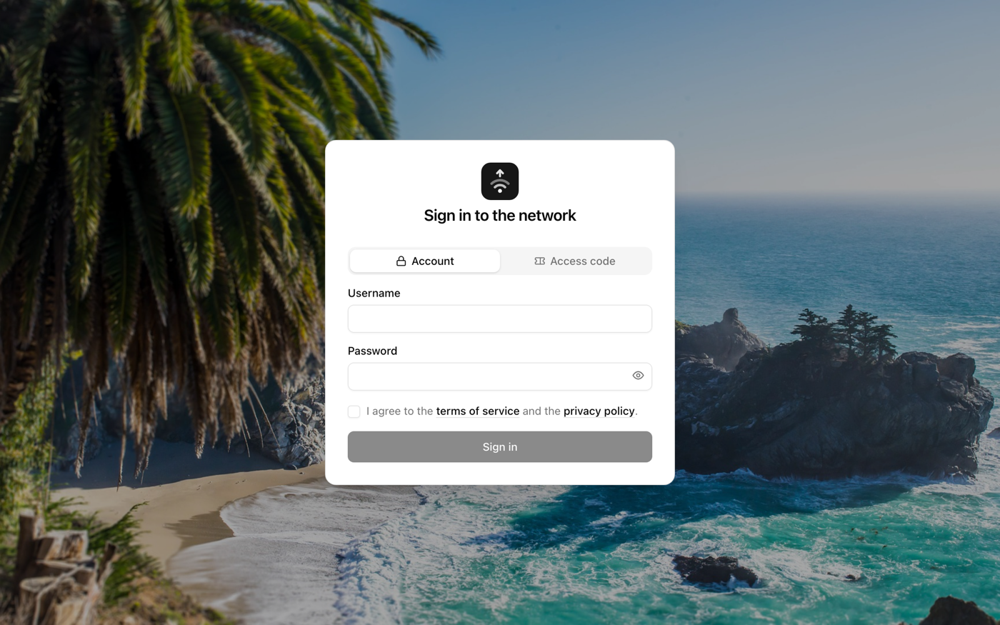
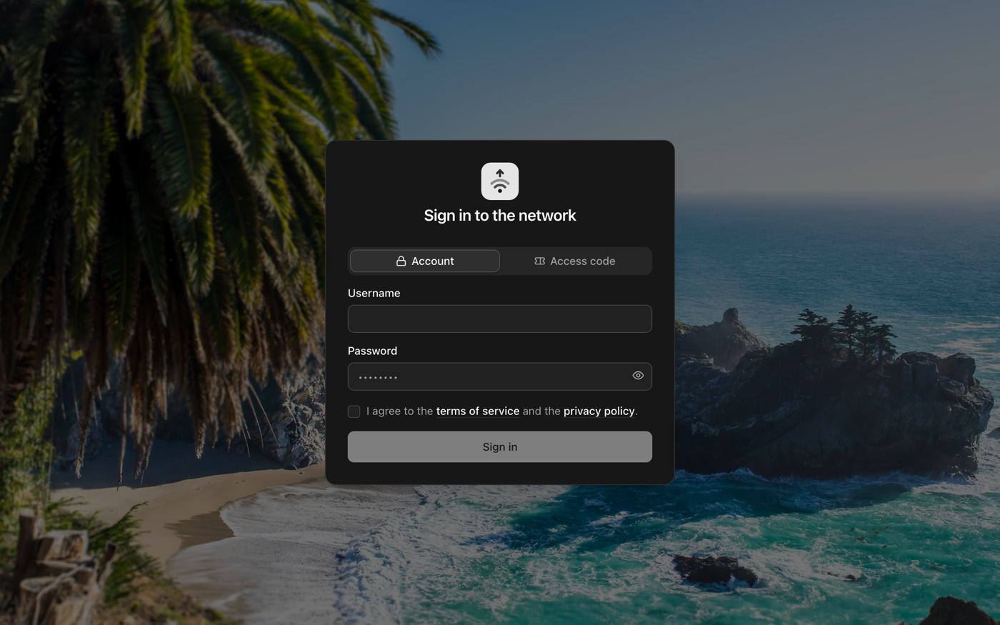
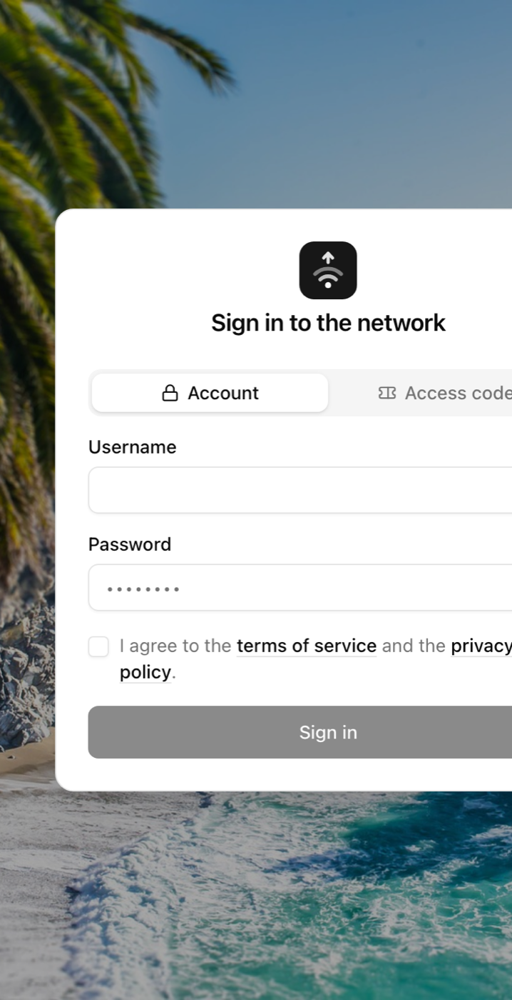
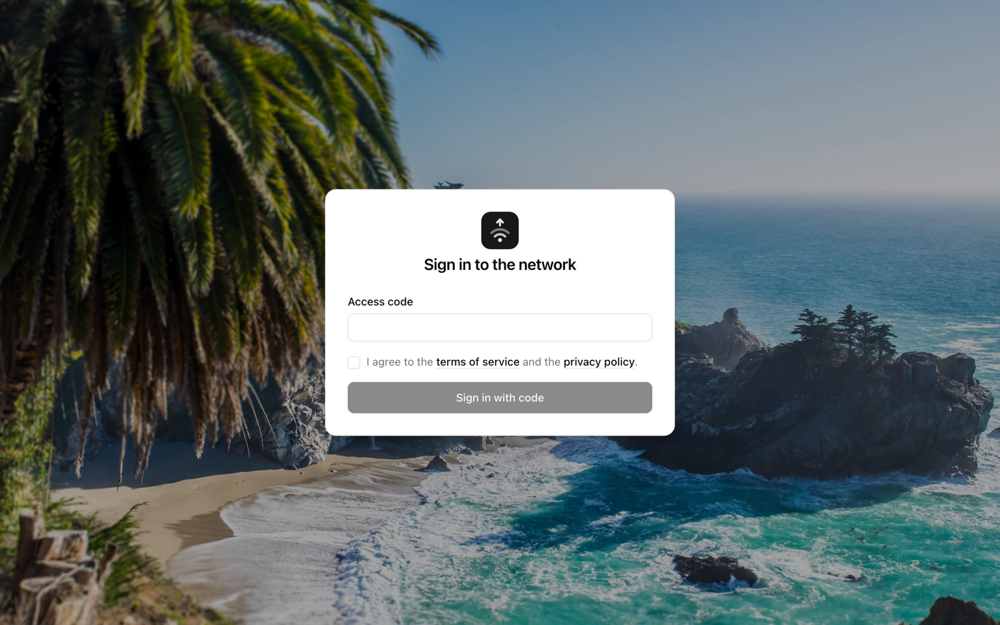
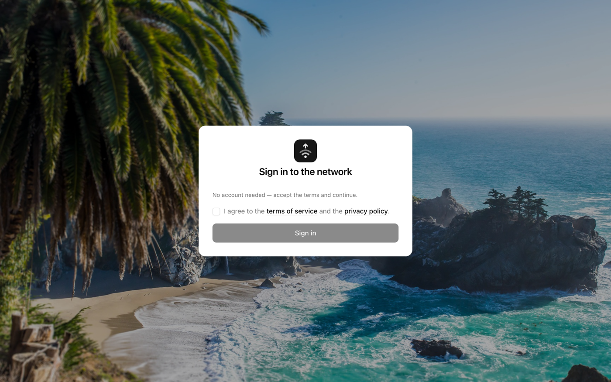
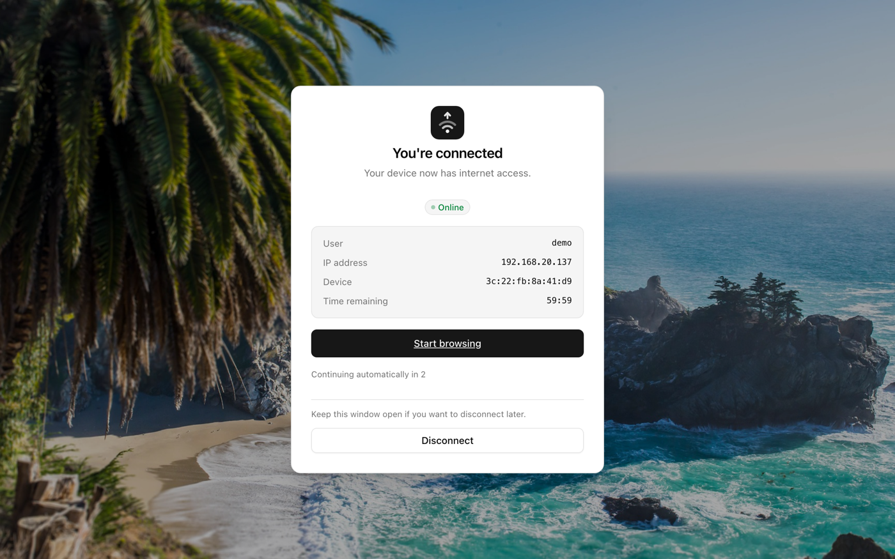

# pfSense Captive Portal

Beautiful, secure, self-contained login pages for the [pfSense®](https://www.pfsense.org/) captive portal.
Styled after [shadcn/ui](https://ui.shadcn.com), built with zero dependencies, compatible with
**pfSense CE 2.7.x / 2.8.x** and **pfSense Plus 24.x / 25.x**.

<p align="center">
  
</p>

<p align="center">
  
  
</p>

## Highlights

- **It configures itself.** The page asks your zone's settings at request time
  (pfSense executes portal pages as PHP) and renders the right variant on its
  own — no options to keep in sync with the firewall.
- **shadcn/ui look, no framework.** The current shadcn design language —
  OKLCH neutral palette, translucent dark-mode borders, 3px focus rings —
  hand-translated into vanilla CSS. No React, no Tailwind, no CDN, no npm.
- **Self-contained by construction.** Everything is inlined into three HTML
  files. That's not an optimisation: a pre-authentication client cannot load
  *anything* from the internet, so a CDN reference means a broken page.
- **47 languages, chosen automatically.** The page adopts the browser/system
  language on every load (incl. RTL Arabic, Hebrew, Urdu and Persian). No
  picker, no cookies.
- **Dark mode by system.** Follows `prefers-color-scheme` live — including
  while the page is open. No flash of the wrong theme on load.
- **Hardened.** Hash-based CSP, escaped-and-guarded PHP logout template, safe
  macro placement, scheme-checked redirects. Details below.

## The four variants

The login page picks its layout from the zone configuration:

| Zone settings | The page renders |
|---|---|
| Auth server **and** vouchers | Toggle at the top: Account ⁄ Access code |
| Auth server only | Username + password, no toggle |
| Vouchers only | Just the code field |
| Neither (click-through) | Terms + sign-in button |

<p align="center">
  
  
</p>

In every variant the terms checkbox sits directly above the submit button and
gates it. RADIUS-MAC zones with fallback get the account form; `?voucher=CODE`
deep links pre-fill the code field. If the firewall's config API is ever
unavailable, the page falls back to showing the toggle variant rather than an
empty card.

After sign-in, the logout page shows the connection status, session details
(user, IP, device, remaining time when RADIUS supplies it), an auto-redirect
countdown that any interaction cancels, and an inline disconnect button:

<p align="center">
  
</p>

## Quick start

**No build step required.** The repository ships the three pages ready to
upload — `portal.html`, `error.html`, `logout.html` at the root, each a single
self-contained file (styles, script, icons, even the background photo are
embedded). Download them, upload them in the pfSense mask, done.

To customise (brand, colours, terms links, languages):

```sh
git clone https://github.com/felixhaeberle/pfsense-captive-portal
cd pfsense-captive-portal

# 1. edit config.json
# 2. regenerate the three pages (any Node ≥ 18, no npm install)
node tools/build.mjs

# 3. preview against a mock pfSense backend
node tools/devserver.mjs     # http://localhost:8080 — demo/demo or 1234-5678
```

The mock backend simulates the real portal: macro substitution, the PHP
conditionals, login/error/logout round trips, even zone-feature flags
(`?noaccounts`, `?novouchers`) to preview each variant.

## Installing on pfSense

1. **Services → Captive Portal → your zone → Configuration** — tick
   *Use custom captive portal page*.
2. Upload the three files:
   - `portal.html` → **Portal page contents**
   - `error.html` → **Auth error page contents**
   - `logout.html` → **Logout page contents**

   Upload all three — a missing error page falls back to pfSense's stock
   template, not to your portal page.
3. That's it for assets — the background image is embedded in the pages.
   (Only if you set `theme.inlineBackgroundImage: false` or reference extra
   images: upload those via the **File Manager** tab, which auto-prefixes
   filenames with `captiveportal-` and has a 1 MB budget per zone.)
4. Using the logout page? Enable **Logout popup window** in the zone —
   pfSense only serves the logout page when that option is on. No popup is
   actually opened; the disconnect button works inline.
5. Save, connect a client to the portal network, enjoy.

### Recommended zone settings

- **Enable HTTPS login** with a certificate for a real DNS name. Without it,
  credentials cross the Wi-Fi in cleartext — the page will show users a
  warning banner if you left `security.warnOnInsecureTransport` on.
- Set **After authentication Redirection URL** unless you want clients sent
  to whatever URL they first requested (`redirurl` is attacker-suppliable by
  link; pfSense validates the scheme, this template re-validates it, but a
  fixed target closes the question entirely).
- Treat **File Manager uploads as production code** — uploaded `.php` files
  execute pre-authentication.

## Configuration

Everything lives in [config.json](config.json); rebuild after any change.

| Key | Default | Notes |
|---|---|---|
| `brand.name` | `"Acme Hotel"` | Substituted into strings as `$BRAND$` |
| `brand.title` | `"Guest Wi-Fi"` | Browser-tab title prefix |
| `brand.logo` | `src/assets/logo.svg` | SVGs are inlined and may use `currentColor`; PNG/JPG are referenced by filename — upload those via File Manager |
| `brand.logoWide` | `false` | For wordmark-shaped logos |
| `brand.favicon` | `true` | Inline data-URI favicon |
| `portal.subtitle` | `false` | Optional subtitle under the title |
| `portal.showClientInfo` | `false` | IP/MAC badges under the card |
| `theme.default` | `"system"` | `light` · `dark` · `system` |
| `theme.allowToggle` | `false` | Manual toggle button. Off = strictly follow the system scheme, ignore any stored preference |
| `theme.radius` | `"0.625rem"` | shadcn radius token |
| `theme.primary` / `primaryForeground` | `null` | Brand colour override, any CSS colour |
| `theme.backgroundImage` | `captiveportal-background.jpg` | `null` for a flat page |
| `theme.inlineBackgroundImage` | `true` | Embed the photo as a data: URI so each page is one uploadable file. Off = reference by filename and upload it via File Manager (smaller config.xml backups, one more step) |
| `theme.backgroundBlur` | `false` | Blur the photo behind the card |
| `auth.detect` | `true` | Pick the layout variant from the zone config at request time. Off → bake `auth.methods` |
| `auth.methods` | `["account","voucher"]` | Only used with `detect: false` |
| `auth.defaultMethod` | `"account"` | Initially active side of the toggle |
| `auth.usernameAutocomplete` | `"username"` | e.g. `email` if usernames are emails |
| `auth.showPasswordToggle` | `true` | Reveal-password eye |
| `auth.voucherFormat` | `""` | Set only if your codes really have a format, e.g. `"XXXX-XXXX-XXXX"` — it becomes the placeholder. pfSense default codes are dash-less and case-sensitive, so it ships empty |
| `auth.voucherAutoFormat` | `false` | Group/uppercase while typing; only applies with a `voucherFormat` |
| `terms.required` | `true` | Checkbox above the submit button, gating it |
| `terms.termsUrl` / `privacyUrl` | example.com | Must be reachable pre-auth: allow the host under *Allowed Hostnames*, or upload the document via File Manager and use a relative path |
| `terms.openInNewTab` | `true` | |
| `logout.showSessionDetails` | `true` | User / IP / device / remaining time |
| `logout.showDisconnectButton` | `true` | Inline `logout_id` POST |
| `logout.autoRedirect` | `true` | Countdown; any interaction cancels |
| `logout.autoRedirectDelay` | `3` | Seconds |
| `i18n.enabled` | `true` | |
| `i18n.default` | `"en"` | Language baked into the markup (no-JS fallback) |
| `i18n.languages` | `"all"` | All 27, or list a subset |
| `i18n.detect` | `true` | Adopt the browser/system language per load |
| `security.csp` | `true` | Hash-based Content-Security-Policy; leave on |
| `security.clientSideValidation` | `true` | Server always validates anyway |
| `security.warnOnInsecureTransport` | `true` | HTTP warning banner |
| `footer.text` | `""` | Optional help line under the card |

Languages: en, de, fr, es, it, pt, nl, pl, cs, sk, hu, ro, bg, hr, el, tr,
ru, uk, sv, no, da, fi, ja, zh, ko, ar, he, hi, bn, ur, fa, id, ms, th, vi,
fil, ta, sr, sl, lt, lv, et, is, ca, sq, sw, az. Legacy browser tags are
mapped (iw→he, in→id, tl→fil, nb/nn→no). Add or adjust in
[src/i18n.json](src/i18n.json) — missing keys fall back to the default
language, so partial translations are fine.

## Security

What the pages do beyond looking nice:

- **Content-Security-Policy with script hashes** (`default-src 'none'`) is
  baked into every page. Injected inline scripts or event handlers do not
  execute even if output escaping ever regresses — verified with live
  injection tests against the mock backend.
- **pfSense macros only in safe sinks.** `$PORTAL_MESSAGE$`, `$CLIENT_IP$`
  etc. appear exclusively in HTML text/attribute positions, never inside
  `<script>` or `<style>` — the build *fails* if a macro lands there
  (htmlspecialchars is not JS-safe; that's how CVE-2021-20729-class bugs
  happen).
- **The logout template is defensive PHP.** pfSense `include()`s it with
  **unescaped** variables, and on one code path most variables are undefined
  (the stock template renders `href=""` there). This template
  `htmlspecialchars(ENT_QUOTES)`-escapes and `isset()`-guards every value and
  re-validates the redirect target as `http(s)://` in both PHP and JS.
- **The backend contract is honoured precisely**: the submit button is named
  `accept` (with a hidden fallback for scripted submission), the voucher
  field is blanked when the account side submits (pfSense consumes
  `auth_voucher` *before* `auth_user`), and the login/error pages contain no
  stray `<?` for the PHP interpreter to eat.
- **Quiet on the wire**: `referrer: no-referrer` (the logout session id never
  leaks), `noindex`, password-manager-friendly `autocomplete`, and an HTTP
  warning banner for zones without HTTPS login.

## Repository layout

```
config.json          ← the file you edit
portal.html          ← generated — upload to pfSense
error.html           ← generated
logout.html          ← generated
src/
  tokens.css         shadcn design tokens (light + dark)
  app.css            components: card, input, button, toggle, alert, …
  app.js             progressive enhancement: theme, i18n, validation
  i18n.json          27 languages
  assets/logo.svg    placeholder logo — replace it
tools/
  build.mjs          builds + audits the three pages (no dependencies)
  devserver.mjs      mock pfSense backend for local preview
  screenshots.sh     regenerates the README screenshots
  add-languages.mjs  source of the bundled translations
```

Everything works without JavaScript: the toggle is CSS-only, the terms
checkbox falls back to native `required`, and no navigation depends on
script. JS adds the niceties — blanking the inactive panel, inline errors,
the busy spinner, live language/theme switching.

## License

MIT — see [LICENSE](LICENSE).

*pfSense is a registered trademark of Rubicon Communications, LLC. This
project is not affiliated with or endorsed by Netgate.*
